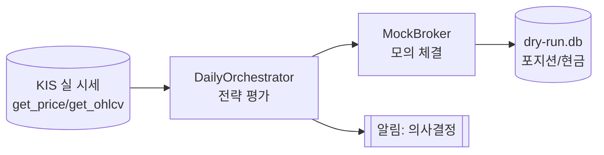
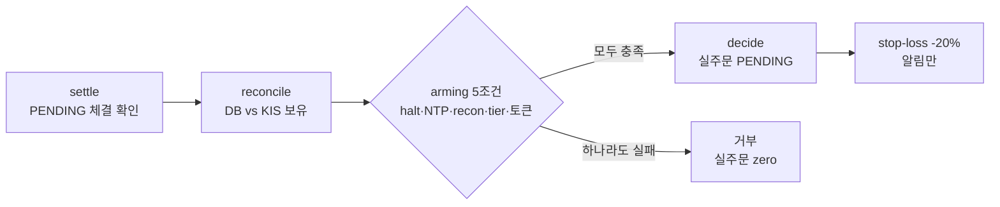

# StockFlow 사용 가이드 (Phase 1.1)

> 이 문서는 **현재 구현된 기능만** 기준으로 작성되었습니다. 아직 없는 기능은
> "❌ 미구현"으로 명확히 표시합니다. 실거래(real money)는 D16 게이트 뒤이며 이
> 문서의 대부분은 **dry-run / paper(모의)** 기준입니다.
>
> 정본: `CLAUDE.md` · `docs/decisions/0012-phase-1-kis-real-trading.md` ·
> `docs/decisions/0020-phase-1.1-kis-api-open-questions.md`

---

## 0. 한눈에 보기

```mermaid
flowchart TD
    subgraph CLI["trading CLI (src/cli)"]
        BT[backtest] ; PA[paper] ; DR[dry-run] ; RC[reconcile]
        KC[kis-check] ; LV[live] ; HL[halt/resume] ; CV[config validate]
    end
    CLI --> COMP[composition root\n전략·어댑터·DB 배선]
    COMP --> DOM[domain\n전략/규칙 (외부 모름)]
    COMP --> KIS[(KIS API\n한국투자증권)]
    COMP --> DB[(SQLite\ntrading.db / dry-run.db)]
    COMP --> TG[[텔레그램/콘솔 알림\n송신 전용]]
```

명령별 한 줄 요약:

| 명령 | 용도 | 실주문 | 실계좌 |
|------|------|--------|--------|
| `backtest` | 과거 CSV로 전략 백테스트 | ❌ | ❌ |
| `paper` | 과거/CSV 기반 모의 1일 (SQLite 상태) | ❌ | ❌ |
| `dry-run` | **실 KIS 시세 + 모의 체결** (paper-on-live) | ❌ | ❌(시세만) |
| `kis-check` | KIS 연결 스모크(잔고/보유/현재가 read) | ❌ | read만 |
| `reconcile` | DB 포지션 vs 실 KIS 보유 대조 | ❌ | read만 |
| `live` | **실거래 일일 runner** (arming 게이트 뒤) | ⚠️ arming 후 | ⚠️ |
| `halt`/`resume` | 영속 정지/재개 sentinel | — | — |
| `config validate` | 전략 YAML 검증 | ❌ | ❌ |

> 모든 명령은 `uv run --env-file .env trading <명령>` 형태로 실행합니다.

---

## 1. 사전 준비 — `.env` 설정 (dry-run 필수)

dry-run 은 **실 KIS 시세**를 읽으므로 KIS 모의투자(VTS) 키가 필요합니다(주문은
모의 체결이라 계좌는 안 건드림).

### 1.1 키 발급
1. [한국투자증권 KIS Developers](https://apiportal.koreainvestment.com) 가입
2. **모의투자** 신청 + 모의투자용 앱(App) 등록 → `appkey` / `appsecret` 발급
3. 모의투자 계좌번호 확인 (앞 8자리 = `CANO`, 뒤 2자리 = `PRDT_CD`, 보통 `01`)

### 1.2 `.env` 작성
```bash
cp .env.example .env
# .env 를 열어 KIS_PAPER_* 를 채운다 (KIS_REAL_* 는 비워둠)
```

```dotenv
KIS_TRADING_MODE=paper            # paper(모의) | real(실계좌, Stage 8에서만)

KIS_PAPER_APPKEY=<모의 appkey>
KIS_PAPER_APPSECRET=<모의 appsecret>
KIS_PAPER_ACCOUNT_CANO=50012345   # 계좌 앞 8자리
KIS_PAPER_ACCOUNT_PRDT_CD=01

# 텔레그램 알림(선택) — 미설정 시 콘솔에만 출력
TELEGRAM_BOT_TOKEN=<봇 토큰>      # 비워두면 console-only
TELEGRAM_CHAT_ID=<채팅 ID>
```

> ⚠️ `.env` 는 `.gitignore` 등록됨 — **절대 commit 금지**. `appsecret`/토큰은 돈에
> 직결됩니다.

### 1.3 연결 확인
```bash
uv run --env-file .env trading kis-check
# → KIS mode=paper host=... appkey=PK12***  / 예수금 / 보유 / 현재가 출력
```

---

## 2. dry-run 실행 (paper-on-live)

**실 KIS 시세 + 인메모리 MockBroker 체결**. 실주문/실계좌 잔고 조회 zero. 날짜를
바꿔 며칠 돌리면 SQLite(`dry-run.db`)에 상태가 누적되어 다일 동작을 관찰할 수 있음.



### 기본 실행
```bash
uv run --env-file .env trading dry-run \
  --code 069500 --code 132030 \
  --db dry-run.db \
  --capital 10000000 \
  --date 2026-05-22
```

| 옵션 | 기본값 | 설명 |
|------|--------|------|
| `--code` | `069500`, `132030` | 평가 종목(반복 지정). 레지스트리 등록 종목만 |
| `--db` | `dry-run.db` | 시뮬 상태 SQLite (실거래 `trading.db`와 분리) |
| `--capital` | 10,000,000 | 최초 1회 초기 자본 (이후 DB에서 복원) |
| `--date` | 오늘(KST) | 평가할 KST 거래일 |
| `--config` 또는 전략 플래그 | — | §4/§5 참조 (둘은 상호 배타) |

> dry-run 의 매도 임계는 플래그 미지정 시 **+15%**(D7)로 자동 설정됩니다.

### 출력 해석
```
DRY-RUN — 실주문 없음, 실계좌 미사용 (MockBroker 시뮬 체결)
mode=paper-on-live  market_data=KIS(...)  date=2026-05-22
  KRX:069500: intended buy_split_1        ← 그날 의사결정
  KRX:132030: intended skip:strategy_no_buy
Cash (simulated): 9,650,000 KRW
Total value (simulated): 10,012,000 KRW (return 0.12%)
Positions (simulated): ...
```

---

## 3. 시스템 동작 흐름 (참고)

### dry-run / paper 의 일일 평가
```mermaid
flowchart TD
    S[신호 NullSignal] --> D[데이터: 현재가/지표]
    D --> SELL[SELL 루프\n익절 +15% 슬롯 매도]
    SELL --> BUY[BUY 평가\n전략별 매수 트리거]
    BUY --> ORD[주문 → 체결(모의)]
    ORD --> DEC[(Decision 기록\nreasoning 전체 보존)]
```

### live 실거래 runner (참고 — arming 게이트 뒤에서만 실주문)


---

## 4. 전략 선택 방법

전략은 **YAML 의 `buy_strategy` / `sell_strategy` / `reentry_strategy`** 로 고릅니다.

### 매수 전략 (`buy_strategy`)
| 값 | 전략 | 설명 |
|----|------|------|
| `price_drop` | PriceDropStrategy (세븐 스플릿) | 가격 하락 시 분할 매수(슬롯 1~7). Phase 1.1 기본 |
| `support_level` | SupportLevelStrategy | 지지선(MA/최근고점/BB·RSI)별 슬롯 매수 |

### 매도 전략 (`sell_strategy`)
| 값 | 설명 |
|----|------|
| `profit_target` | 슬롯별 평단 대비 +N% 도달 시 매도 (현재 유일) |

### 재진입 정책 (`reentry_strategy`, `price_drop` 에서만 사용)
| 값 | 설명 | 비고 |
|----|------|------|
| `hybrid` | 매도 후 `cooldown_days` 경과해야 재매수 | 플래그 방식 가능 |
| `moving_average` | 이동평균 기반 재진입 | `--config` 필수(window/ma_type) |

> ❗ **그리드(DGT)** 전략은 `src/research/` 의 **연구 전용**이며 라이브/dry-run 에
> 배선돼 있지 않습니다(Phase 1 미합류). `buy_strategy` 로 선택 불가.

---

## 5. 전략 세부 설정 방법

두 가지 방식 — **YAML(`--config`, 권장)** 또는 **CLI 플래그**. (상호 배타)

### 5.1 YAML 방식 (권장 — 재현성)

`config/strategies-*.yaml` 예시 (`config/strategies-0.7.3.yaml`):
```yaml
version: "0.5"
allocation_policy: EQUAL          # EQUAL | INV_VOL | VOL
assets:
  "069500":
    name: "KODEX 200"
    enabled: true                 # false → 이 종목 제외 (삭제 효과)
    buy_strategy: "price_drop"
    buy_parameters:
      drop_threshold_pct: 5.0     # 매수 트리거 하락률(%)
      max_split_count: 7          # 최대 분할 수(1~7)
      per_split_amount: 5000000   # 분할 1회 매수 금액(KRW)
      max_split_per_day: 1        # 하루 최대 체결 분할 수
    sell_strategy: "profit_target"
    sell_parameters:
      profit_target_pct: 10.0     # 익절 임계(%) — 라이브 권장 15.0(D7)
      max_sells_per_day: 7
    reentry_strategy: "hybrid"
    reentry_parameters:
      cooldown_days: 60           # 매도 후 재매수 금지 일수
  "132030":
    name: "KODEX 골드선물(H)"
    enabled: true
    buy_strategy: "price_drop"
    # ... (아래 §6.4 정책 동일성 규칙 주의)
```

검증 후 실행:
```bash
uv run --env-file .env trading config validate --config config/my.yaml
# dry-run + --config → 종목은 YAML 의 enabled 목록에서 가져옴 (--code 불필요)
uv run --env-file .env trading dry-run --config config/my.yaml --db dry-run.db
```
> 참고: `--config` 모드에서 `backtest`/`paper` 는 `--csv CODE=path.csv` 매핑이
> 필요하고, `dry-run` 은 실 KIS 시세를 쓰므로 CSV 없이 YAML 의 종목을 그대로
> 사용합니다. 플래그 방식(§5.2)에서는 `--code` 로 종목을 지정합니다.

### 5.2 CLI 플래그 방식 (단일 종목, 빠른 실험)
```bash
uv run --env-file .env trading dry-run --code 069500 \
  --drop-pct 5.0 --max-split 7 --per-split-amount 5000000 \
  --max-split-per-day 1 --profit-target-pct 15.0 \
  --max-sells-per-day 7 --reentry-strategy hybrid --cooldown-days 60
```
> `--config` 와 전략 플래그는 **동시 사용 불가**(에러). `moving_average` 는
> `--config` 필수.

### 5.3 파라미터 의미 요약
| 파라미터 | 의미 |
|----------|------|
| `drop_threshold_pct` | 직전 진입가 대비 이만큼 떨어지면 다음 슬롯 매수 |
| `max_split_count` | 한 종목 최대 분할(=슬롯) 수 |
| `per_split_amount` | 분할 1회 매수 금액(원) |
| `max_split_per_day` | 하루 허용 매수 체결 수(보통 1) |
| `profit_target_pct` | 슬롯 평단 대비 +이만큼이면 매도 |
| `cooldown_days` | 매도한 슬롯을 며칠 뒤부터 재매수 허용 |
| `allocation_policy` | 종목 간 자본 배분(EQUAL/역변동성/변동성) |

---

## 6. 종목 추가 / 삭제 / 전략 수정

> ### ⚠️ 텔레그램으로는 불가능합니다 (현재)
> 텔레그램은 **알림(송신) 전용**입니다 — 봇이 메시지를 *보내기만* 하고 명령을
> *받지 않습니다*(getUpdates/webhook 미구현). 따라서 **텔레그램으로 종목 추가/삭제/
> 전략 수정은 현재 불가능**합니다. 아래의 YAML/코드 방식만 지원합니다.
> (텔레그램 양방향 명령은 향후 별도 Phase 기능으로 추가 가능 — 미구현.)

### 6.1 종목 추가
2단계가 필요합니다.

1. **종목이 레지스트리에 등록되어 있어야** 합니다 (`src/cli/composition.py` 의
   `_ASSET_FACTORIES`). 현재 등록 종목:
   `069500, 214980, 132030, 005930, 005380, 055550, 097950, 015760, 298040`.
   - 등록된 종목이면 → YAML/`--code` 에 추가만 하면 됨.
   - **미등록 종목**이면 → `composition.py` 에 Asset 팩토리 추가(코드 변경)가
     필요합니다(상장일/시장/호가단위 등 메타데이터 필요 — Phase 0.7.1 설계).
2. **YAML 에 항목 추가** (또는 `--code <코드>` 반복 지정):
```yaml
assets:
  "005930":
    name: "삼성전자"
    enabled: true
    buy_strategy: "price_drop"
    buy_parameters: { drop_threshold_pct: 5.0, max_split_count: 7,
                      per_split_amount: 2000000, max_split_per_day: 1 }
    sell_strategy: "profit_target"
    sell_parameters: { profit_target_pct: 15.0, max_sells_per_day: 7 }
    reentry_strategy: "hybrid"
    reentry_parameters: { cooldown_days: 60 }
```

### 6.2 종목 삭제(제외)
YAML 에서 해당 종목의 **`enabled: false`** 로 두거나 항목을 제거합니다.
(`--code` 방식이면 그 코드를 빼면 됨.)

### 6.3 전략 수정
해당 종목의 `buy_strategy` / `*_parameters` 값을 YAML 에서 바꾼 뒤
`config validate` → 재실행. CLI 플래그 방식이면 플래그 값을 바꿔 재실행.

### 6.4 ⚠️ 정책 동일성 규칙 (중요)
한 번의 실행에 들어가는 **모든 종목은 같은 전략 *타입*과 정책**을 써야 합니다
(ADR 0003 §7.3). 즉 종목별로 다른 `buy_strategy`/파라미터를 섞으면 로더가
거부합니다. (종목별 차등 정책은 Phase 1+ 기능 — 미구현.)

### 6.5 ⚠️ 실거래(Phase 1.1) 중에는 "변경 zero"
실거래 안정화 기간에는 **`src/` 코드 + `config/strategies.yaml` 변경 금지**
(D13 변경 zero invariant). 비상 변경 4사유(Kill switch / Reconciliation 불일치 /
KIS 시그니처 변경 / -20% 손실한도) 외에는 사람 명시 + ADR 박제 후에만 변경.
→ 종목/전략 변경은 **dry-run / paper 단계에서** 충분히 실험하세요.
상세: `docs/runbooks/phase-1.1-emergency-change.md`

---

## 7. 텔레그램 알림 (송신 전용)

설정(`TELEGRAM_BOT_TOKEN`+`TELEGRAM_CHAT_ID`) 시 콘솔과 함께 텔레그램으로도 전송.
미설정 시 콘솔만. 전송 실패해도 거래는 멈추지 않음(소리만 크게 로깅).

알림 종류(ADR 0012 D3):
| 레벨 | 내용 |
|------|------|
| INFO | 매수 의사결정 / 매도 체결 / 일일 요약 |
| WARNING | -20% 손실 임계 도달(매도 검토 권고) / supervised hold |
| ERROR | KIS outage / token 만료 |
| CRITICAL | Reconciliation 불일치 / Kill switch 발화 |

> 받기만 합니다 — 텔레그램으로 명령(종목/전략 변경, 매수/매도)을 보낼 수는 **없음**.

---

## 8. 안전장치 & 정지/재개

| 상황 | 동작 |
|------|------|
| `TRADING_HALT=1` (Kill switch) | 모든 명령 진입 시 즉시 정지(clean exit) |
| 영속 halt sentinel | `trading halt --reason "..."` → 이후 명령 차단 |
| 재개 | `trading resume` (사람 명시) |
| Reconciliation 불일치 | 자동 정지 + CRITICAL 알림 + 사람 개입(자동수정 zero) |
| NTP 미동기화 | 거래 거부(fail-closed) |

```bash
uv run --env-file .env trading halt --reason "점검"
uv run --env-file .env trading resume
uv run --env-file .env trading reconcile --db trading.db
```

---

## 9. 실거래(live)는 아직 — 게이트 안내

`trading live` 코드는 완성되어 있으나, **실주문은 무장(arming) 게이트 뒤에서만**
나갑니다. 무장하지 않으면 settle+reconcile 만 하고 거부(실주문 zero).

실거래 ON 전제(현재 미충족, 사람 결정):
- `.env` → `real` 전환 + 실계좌 키
- paper 무사고 10영업일 + NTP + D16 (i)~(vi) 충족
- 무장 토큰: `--arm-live <tier>` + `TRADING_ARM_LIVE=<tier>` 환경변수(이중 확인)

> 지금 단계 권장: **dry-run** 으로 며칠~몇 주 돌려 의사결정 파이프라인을 관찰하고
> 전략/종목을 충분히 다듬으세요. 실거래 전환은 그 다음입니다.

---

## 부록 A. 자주 쓰는 명령 모음
```bash
# 연결 확인
uv run --env-file .env trading kis-check

# dry-run (오늘, 기본 2종목)
uv run --env-file .env trading dry-run --db dry-run.db

# dry-run (전략 YAML — 종목은 YAML enabled 에서)
uv run --env-file .env trading dry-run --config config/my.yaml \
  --date 2026-05-22 --db dry-run.db

# 전략 YAML 검증
uv run --env-file .env trading config validate --config config/my.yaml

# DB vs 실 KIS 보유 대조
uv run --env-file .env trading reconcile --db trading.db

# 정지 / 재개
uv run --env-file .env trading halt --reason "점검"
uv run --env-file .env trading resume
```
